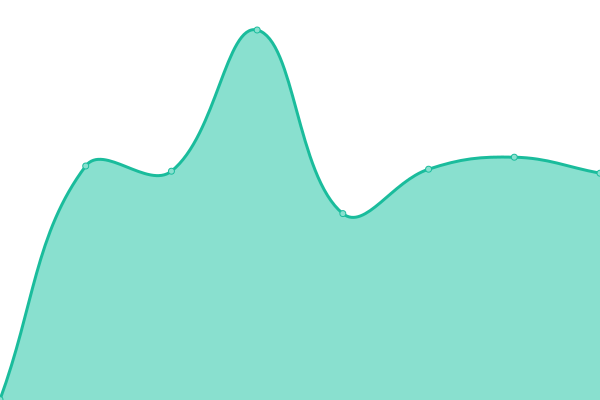

# [📈 Live Status](https://lkeegan.github.io/monitoring): <!--live status--> **🟩 All systems operational**

<!--start: status pages-->
<!-- This summary is generated by Upptime (https://github.com/upptime/upptime) -->
<!-- Do not edit this manually, your changes will be overwritten -->
<!-- prettier-ignore -->
| URL | Status | History | Response Time | Uptime |
| --- | ------ | ------- | ------------- | ------ |
|  [SSC](https://ssc.uni-heidelberg.de) | 🟩 Up | [ssc.yml](https://github.com/lkeegan/monitoring/commits/HEAD/history/ssc.yml) | 

 7317ms
     
 | 

<a href="https://lkeegan.github.io/monitoring/history/ssc">100.00%</a>
    

|  [MONDEY](https://mondey.de) | 🟩 Up | [mondey.yml](https://github.com/lkeegan/monitoring/commits/HEAD/history/mondey.yml) | 

 560ms
     
 | 

<a href="https://lkeegan.github.io/monitoring/history/mondey">100.00%</a>
    

|  [PredicTCR](https://predictcr.com) | 🟩 Up | [predic-tcr.yml](https://github.com/lkeegan/monitoring/commits/HEAD/history/predic-tcr.yml) | 

 497ms
     
 | 

<a href="https://lkeegan.github.io/monitoring/history/predic-tcr">100.00%</a>
    

|  [SampleFlow](https://circuitseq.iwr.uni-heidelberg.de/) | 🟩 Up | [sample-flow.yml](https://github.com/lkeegan/monitoring/commits/HEAD/history/sample-flow.yml) | 

 3409ms
     
 | 

<a href="https://lkeegan.github.io/monitoring/history/sample-flow">100.00%</a>
    

<!--end: status pages-->
